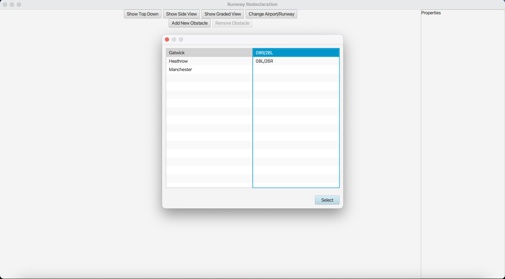

# AIRPORT RUNWAY REDECLARATION TOOL
### COMP2211: Software Engineering Group Project
### Group 20
## Table of Contents
- [Project Description](#project-description)
- [Dependencies](#dependencies)
- [Solved Problems](#solved-problems)
- [Interfaces](#interfaces)
- [Special Features](#special-features)
- [Project Updates](#project-updates)

## Project Description

This is a tool designed and developed for the airport staffs **to calculate a new reasonable solution** on the system to help the aircraft take off or land safely when there is an obstacle on the runway.

## Dependencies
- JDK 20

## Interfaces
- Initial Interface

## Solved Problems
- High practicality
- Help reduce the time
- Help reduce staff costs
- Help reduce the probability of errors

## Special Features
- Side-on view or top-down view are offered
- Data can be imported and exported
- Notifications are updated in real time

## Project Updates
- [version1.0](docs/version1.pdf)
    - Implemented functions: select airport and runway, switch perspective, change airport or runway
- [version2.0](docs/v2.0.pdf)
    - Implemented functions: select airport and runway, top-view, change airport or runway, add and remove obstacle, properties are shown

